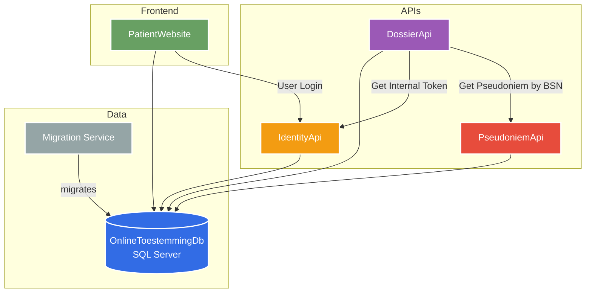

# Online Toestemming Workshop - Architecture

## High-Level Architecture Diagram

```mermaid
graph TB
    subgraph Frontend
        PW[PatientWebsite]
    end
    
    subgraph APIs
        IA[IdentityApi]
        PA[PseudoniemApi]
        DA[DossierApi]
    end
    
    subgraph Data
        DB[(OnlineToestemmingDb<br/>SQL Server)]
        MS[Migration Service]
    end
    
    %% Database connections
    MS -->|migrates| DB
    IA --> DB
    PA --> DB
    DA --> DB
    PW --> DB
    
    %% Service dependencies
    DA -->|Get Internal Token| IA
    DA -->|Get Pseudoniem by BSN| PA
    PW -->|User Login| IA
    
    style DB fill:#326ce5,stroke:#fff,stroke-width:2px,color:#fff
    style PW fill:#68a063,stroke:#fff,stroke-width:2px,color:#fff
    style IA fill:#f39c12,stroke:#fff,stroke-width:2px,color:#fff
    style PA fill:#e74c3c,stroke:#fff,stroke-width:2px,color:#fff
    style DA fill:#9b59b6,stroke:#fff,stroke-width:2px,color:#fff
    style MS fill:#95a5a6,stroke:#fff,stroke-width:2px,color:#fff
```
